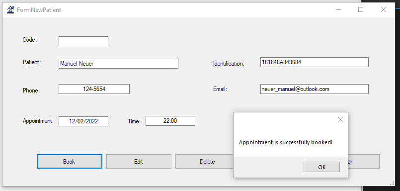
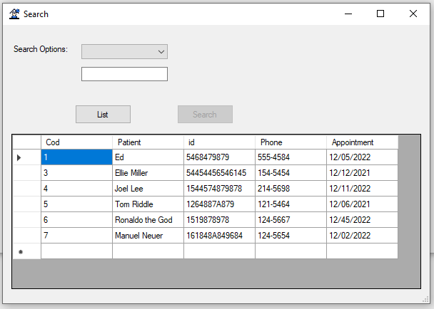
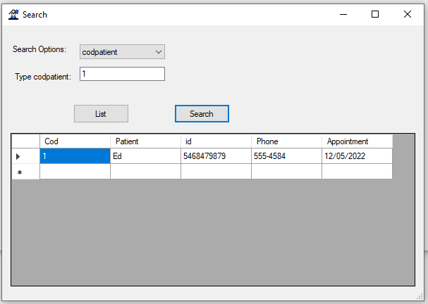
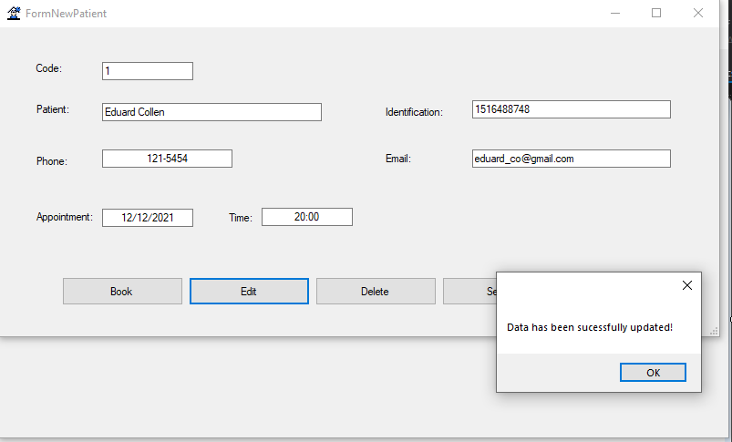
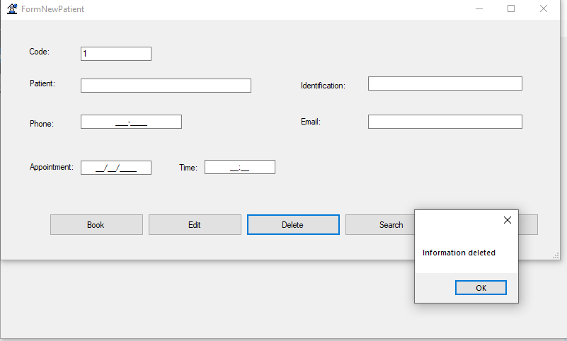
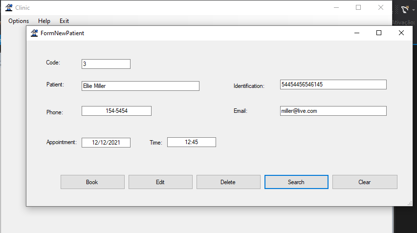
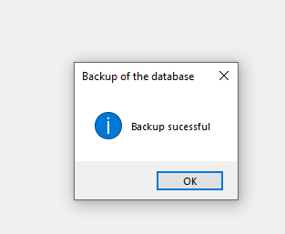
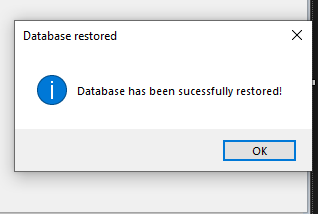
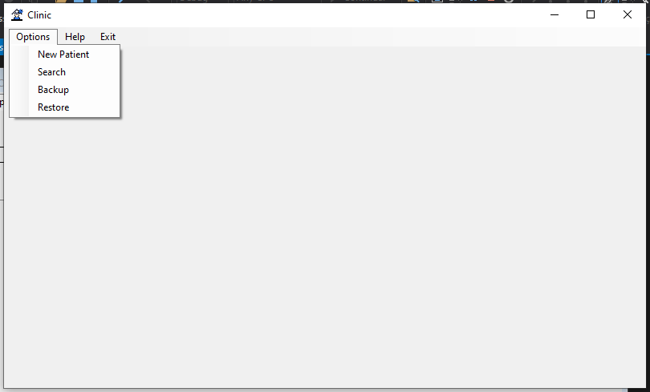

# Therapy-Clinic-House
<ul>
  <li>System for a therapy clinic or the like.</li>
  <li>Stack: WindowsForm, .NET Framework (C#), MySQL.</li>
<ul/>

<h1>The application</h1>
<h4>New Appointment</h4>

 
<h4>List</h4>

 
<h4>Search by id</h4>

 
<h4>Update</h4>

 
<h4>Delete by id</h4>

 
<h4>Result of searching by id</h4>

 
<h4>Backup</h4>

 
<h4>Restore database</h4>

 
<h4>Menu: tab</h4>

 
